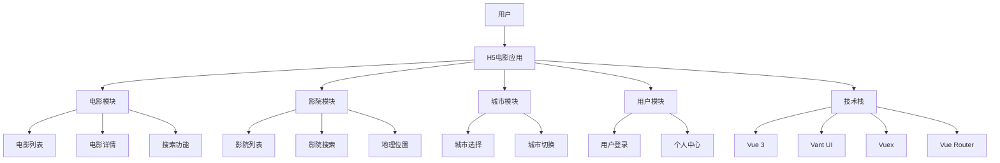
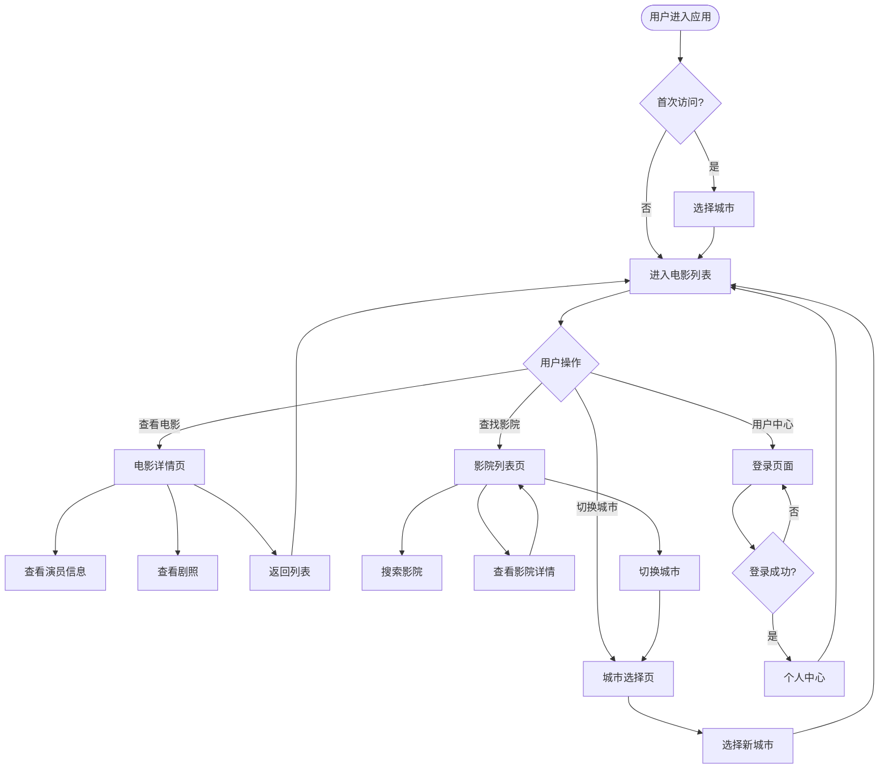
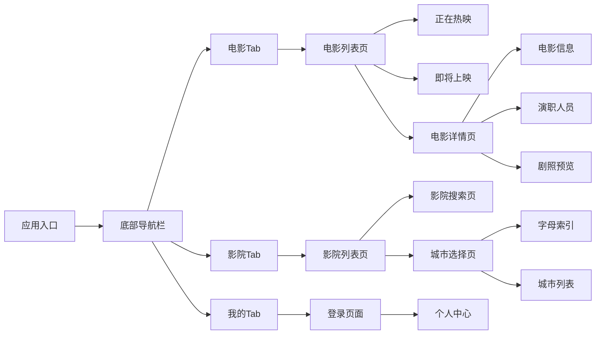
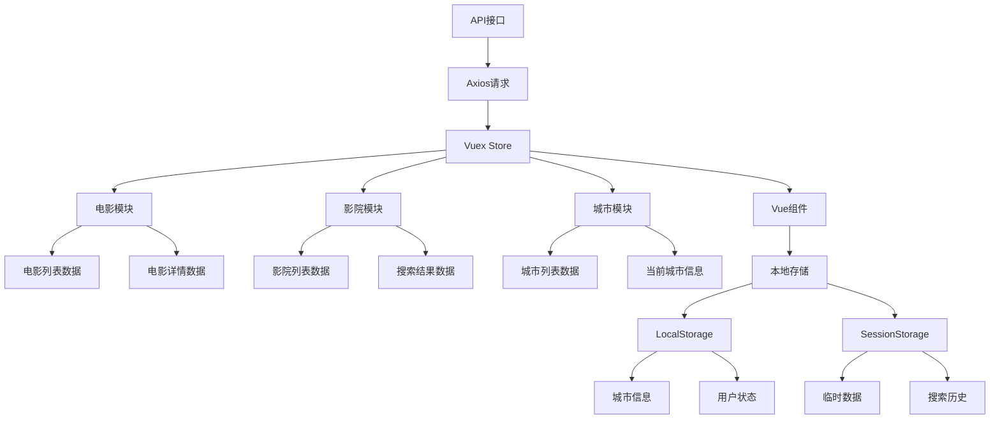
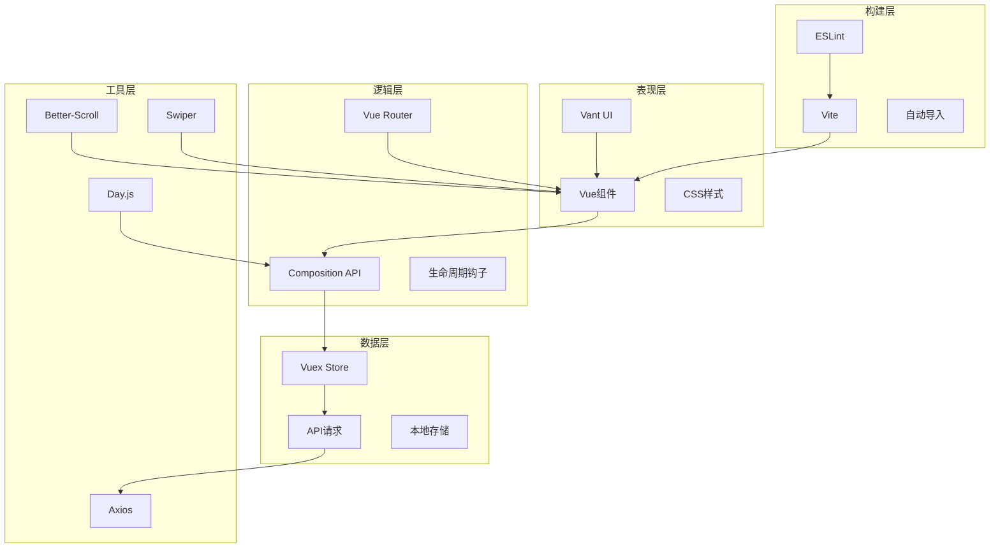
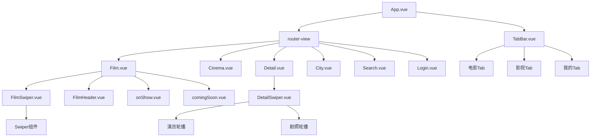
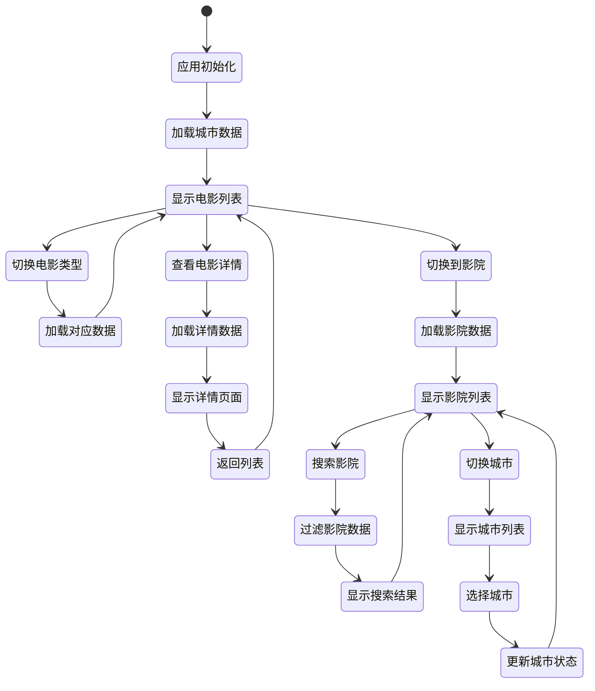
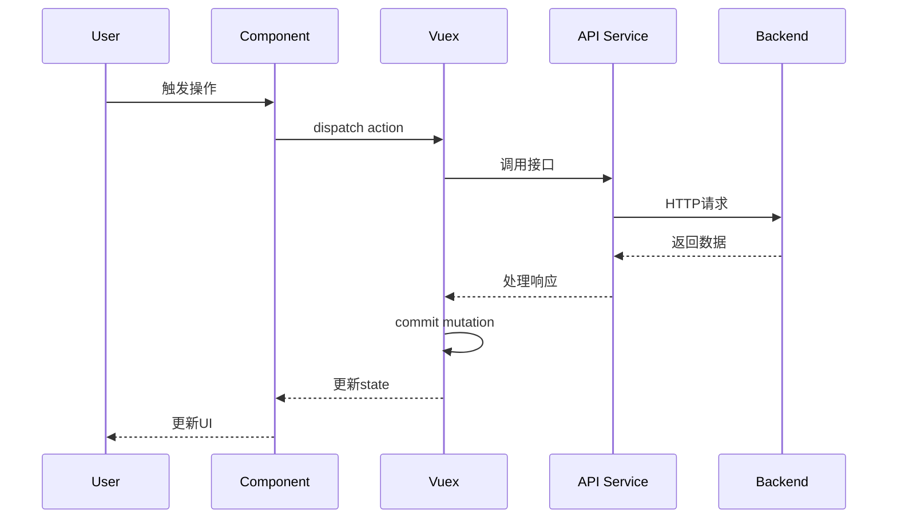
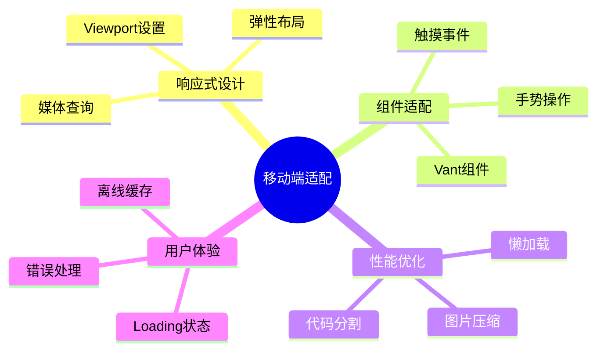
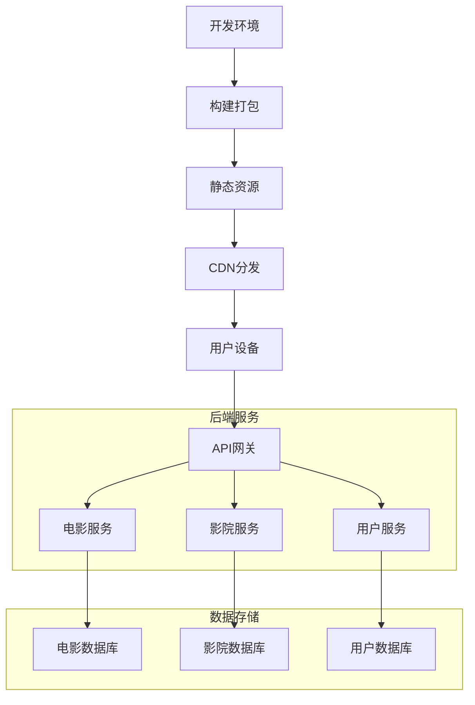

# H5电影票务应用 - 可视化架构文档

## 1. 应用架构图

```mermaid
graph TB
    A[用户] --> B[H5电影应用]
    B --> C[电影模块]
    B --> D[影院模块]
    B --> E[城市模块]
    B --> F[用户模块]
    
    C --> C1[电影列表]
    C --> C2[电影详情]
    C --> C3[搜索功能]
    
    D --> D1[影院列表]
    D --> D2[影院搜索]
    D --> D3[地理位置]
    
    E --> E1[城市选择]
    E --> E2[城市切换]
    
    F --> F1[用户登录]
    F --> F2[个人中心]
    
    B --> G[技术栈]
    G --> G1[Vue 3]
    G --> G2[Vant UI]
    G --> G3[Vuex]
    G --> G4[Vue Router]
```

## 2. 用户流程图

```mermaid
flowchart TD
    START([用户进入应用]) --> A{首次访问?}
    A -->|是| B[选择城市]
    A -->|否| C[进入电影列表]
    B --> C
    
    C --> D{用户操作}
    D -->|查看电影| E[电影详情页]
    D -->|查找影院| F[影院列表页]
    D -->|切换城市| G[城市选择页]
    D -->|用户中心| H[登录页面]
    
    E --> E1[查看演员信息]
    E --> E2[查看剧照]
    E --> E3[返回列表]
    
    F --> F1[搜索影院]
    F --> F2[查看影院详情]
    F --> F3[切换城市]
    
    G --> G1[选择新城市]
    G1 --> C
    
    H --> H1{登录成功?}
    H1 -->|是| I[个人中心]
    H1 -->|否| H
    
    E3 --> C
    F2 --> F
    F3 --> G
    I --> C
```

## 3. 页面结构图

```mermaid
graph LR
    A[应用入口] --> B[底部导航栏]
    
    B --> C[电影Tab]
    B --> D[影院Tab]
    B --> E[我的Tab]
    
    C --> C1[电影列表页]
    C1 --> C2[正在热映]
    C1 --> C3[即将上映]
    C1 --> C4[电影详情页]
    
    D --> D1[影院列表页]
    D1 --> D2[影院搜索页]
    D1 --> D3[城市选择页]
    
    E --> E1[登录页面]
    E1 --> E2[个人中心]
    
    C4 --> C4A[电影信息]
    C4 --> C4B[演职人员]
    C4 --> C4C[剧照预览]
    
    D3 --> D3A[字母索引]
    D3 --> D3B[城市列表]
```

## 4. 数据流图

```mermaid
flowchart TD
    A[API接口] --> B[Axios请求]
    B --> C[Vuex Store]
    C --> D[Vue组件]
    
    C --> C1[电影模块]
    C --> C2[影院模块]
    C --> C3[城市模块]
    
    C1 --> C1A[电影列表数据]
    C1 --> C1B[电影详情数据]
    
    C2 --> C2A[影院列表数据]
    C2 --> C2B[搜索结果数据]
    
    C3 --> C3A[城市列表数据]
    C3 --> C3B[当前城市信息]
    
    D --> E[本地存储]
    E --> E1[LocalStorage]
    E --> E2[SessionStorage]
    
    E1 --> E1A[城市信息]
    E1 --> E1B[用户状态]
    
    E2 --> E2A[临时数据]
    E2 --> E2B[搜索历史]
```

## 5. 技术架构图

```mermaid
graph TB
    subgraph 表现层
        A1[Vue组件]
        A2[Vant UI]
        A3[CSS样式]
    end
    
    subgraph 逻辑层
        B1[Vue Router]
        B2[Composition API]
        B3[生命周期钩子]
    end
    
    subgraph 数据层
        C1[Vuex Store]
        C2[API请求]
        C3[本地存储]
    end
    
    subgraph 工具层
        D1[Axios]
        D2[Day.js]
        D3[Better-Scroll]
        D4[Swiper]
    end
    
    subgraph 构建层
        E1[Vite]
        E2[ESLint]
        E3[自动导入]
    end
    
    A1 --> B2
    A2 --> A1
    B1 --> A1
    B2 --> C1
    C1 --> C2
    C2 --> D1
    D2 --> B2
    D3 --> A1
    D4 --> A1
    E1 --> A1
    E2 --> E1
```

## 6. 组件关系图

```mermaid
graph TD
    A[App.vue] --> B[router-view]
    A --> C[TabBar.vue]
    
    B --> D[Film.vue]
    B --> E[Cinema.vue]
    B --> F[Detail.vue]
    B --> G[City.vue]
    B --> H[Search.vue]
    B --> I[Login.vue]
    
    D --> D1[FilmSwiper.vue]
    D --> D2[FilmHeader.vue]
    D --> D3[onShow.vue]
    D --> D4[comingSoon.vue]
    
    F --> F1[DetailSwiper.vue]
    
    C --> C1[电影Tab]
    C --> C2[影院Tab]
    C --> C3[我的Tab]
    
    D1 --> D1A[Swiper组件]
    F1 --> F1A[演员轮播]
    F1 --> F1B[剧照轮播]
```

## 7. 状态管理图

```mermaid
stateDiagram-v2
    [*] --> 应用初始化
    应用初始化 --> 加载城市数据
    加载城市数据 --> 显示电影列表
    
    显示电影列表 --> 切换电影类型
    显示电影列表 --> 查看电影详情
    显示电影列表 --> 切换到影院
    
    切换电影类型 --> 加载对应数据
    加载对应数据 --> 显示电影列表
    
    查看电影详情 --> 加载详情数据
    加载详情数据 --> 显示详情页面
    显示详情页面 --> 返回列表
    返回列表 --> 显示电影列表
    
    切换到影院 --> 加载影院数据
    加载影院数据 --> 显示影院列表
    显示影院列表 --> 搜索影院
    显示影院列表 --> 切换城市
    
    搜索影院 --> 过滤影院数据
    过滤影院数据 --> 显示搜索结果
    显示搜索结果 --> 显示影院列表
    
    切换城市 --> 显示城市列表
    显示城市列表 --> 选择城市
    选择城市 --> 更新城市状态
    更新城市状态 --> 显示影院列表
```

## 8. API调用流程图

```mermaid
sequenceDiagram
    participant 用户 as User
    participant 组件 as Component
    participant 状态管理 as Vuex
    participant API as API Service
    participant 后端 as Backend
    
    用户->>组件: 触发操作
    组件->>状态管理: dispatch action
    状态管理->>API: 调用接口
    API->>后端: HTTP请求
    后端-->>API: 返回数据
    API-->>状态管理: 处理响应
    状态管理->>状态管理: commit mutation
    状态管理-->>组件: 更新state
    组件-->>用户: 更新UI
```

## 9. 移动端适配策略

```mermaid
mindmap
  root((移动端适配))
    响应式设计
      Viewport设置
      弹性布局
      媒体查询
    组件适配
      Vant组件
      触摸事件
      手势操作
    性能优化
      懒加载
      图片压缩
      代码分割
    用户体验
      Loading状态
      错误处理
      离线缓存
```

## 10. 部署架构图

```mermaid
graph TB
    A[开发环境] --> B[构建打包]
    B --> C[静态资源]
    C --> D[CDN分发]
    
    D --> E[用户设备]
    
    subgraph 后端服务
        F[API网关]
        G[电影服务]
        H[影院服务]
        I[用户服务]
    end
    
    E --> F
    F --> G
    F --> H
    F --> I
    
    subgraph 数据存储
        J[电影数据库]
        G --> J
        K[影院数据库]
        H --> K
        L[用户数据库]
        I --> L
    end
``` 